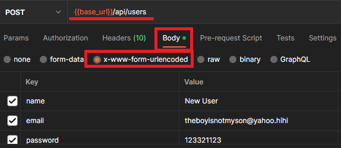

# Instructions : 
## 1. Connecter le backend à votre MongoDB personnel.
- Créer un user dans la base de données
- username : User
- mot de passe : pw4User$
- database : DAWTA-AUTH
- changer le cluster dans database/index.js pour y mettre le votre
## 2. S'assurer que la connection se fait bien lorsque vous démarrez (npm start)
## 3. Créer une "collection" dans Postman
## 4. Créez un "environment" et ajoutez y une variable nommée "base_url" dont la valeur sera : http://localhost:3000
## 5. Créer quatre requêtes HTTP de type et de chemin approprié
- Une POST pour le signup (dans body : name/email/password)
- Une GET pour le fetchUser
- Une POST pour le sessionCreate ( dans body : email/password)
- Une DELETE pour le sessionDelete
----
- Précédez chaque route par {{base_url}} puis le reste de la route (voir les routes du backend dans le dossier "routes")
## 6. Dans la section "body" des requêtes, insérer les clés/valeurs requises pour le fonctionnement.
- Assurez vous que le type d'encryption est bien "x-www-form-urlencoded" (voir image)

- Note : si des cookies auraient à être transmis ou effacés dans votre navigateur, ils le seront également dans PostMan.
